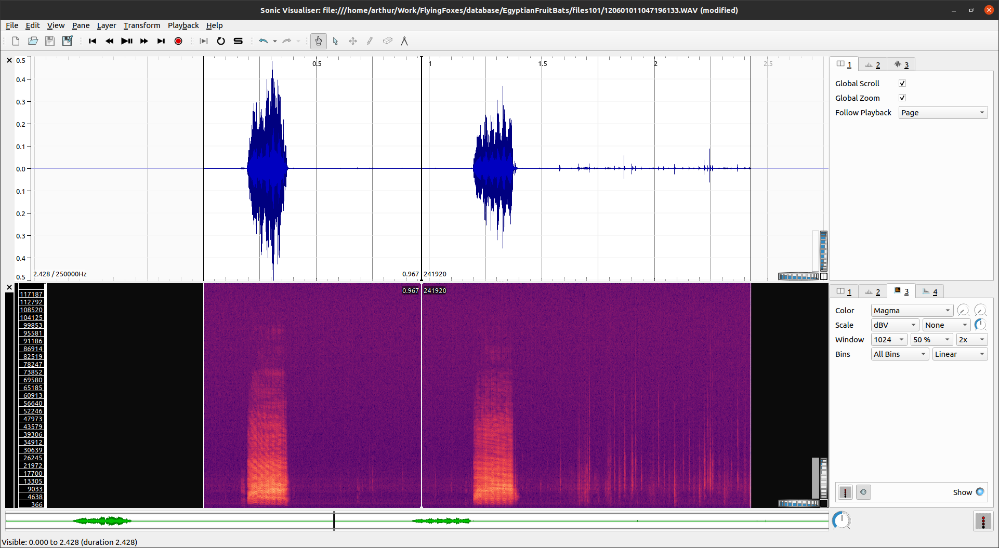

[](https://wakatime.com/badge/user/57d887d6-525a-4214-a78c-21863f2f88f7/project/93d14295-7eb1-438b-b391-744be6d71661)
# DENet training code 

[](https://github.com/psf/black)

## Author 
- [Arthur Zucker](https://github.com/ArthurZucker)
- [Chris Rauch](https://github.com/chrisrauch193)

## Installation 
Clone this repository

## Model 
The model is available at the original github repository : git@github.com:MiviaLab/DENet.git

## Information 
The original DENET code is in tensorflow, but I need to use both YOLOR and DENET, and given that YOLOR is in pytorch, I have to convert the code to pytorch. That's also a good exercise, thus I will do it. 

Moreover, I am using my template implementation which allows to easily switch between model and data type, integrating this also requires a bit of work. 
## TODO 

- [x] Create dataset
- [x] Add `get_model`, `get_loss`, `get_optimizer` from the names
- [x] Create dataloaders
- [x] Convert both [__init__.py](./__init__.py) and [layers.py](./layers.py) to pytorch (since its now in tensorflow)
- [x] Create model 
- [x] Create training agent
- [x] Add utils and choose metric 
- [x] Sample training on subset 
- [ ] Clean hparams
- [ ] Use profiler to check training time and dataleaks
- [ ] Use time distributed for `visualize` function (process full audio)
- [ ] **Use fp16 and mixed precision with apex!**
- [ ] Use https://tut-arg.github.io/sed_eval/sound_event.html var validation metrics
- [ ] Create Docker 
- [ ] Details on the readme 
- [ ] Add to my website 

## Issue : 
output of sincnet and denet is the label at each window of 50ms. Thus the labels that I use should also be of the same format. Which means that when I select an audio file to use, randomly select a part of it? then extract the label from the sample. 
Sample available labels : {500->550},{...},{...} a list of ranges of samples where we know that a flying foxe shouted! 

DENET's input : 1 sequence of 10 frames of 50ms audio (thus 500ms sequences). Per-frame labels. 
SincNet's input : 1 chunk of 200ms, 10ms overlap, 128 batch size. Labels are for each wav file, a single label, which is a bit strange. 


### Annotations 

Realized that the annotations were a bit... Strange? 
In the `FileInfo.csv` file, each call's start sample and end sample is labeled. For example, for the following recording (visualized using sonic Visualiser), 2 calls are visible, the label is the following: 



| File name              | Voice start sample (1) | Voice end sample (1) | Voice start sample (2) | Voice end sample (2) |
|------------------------|------------------------|----------------------|------------------------|----------------------|
| 120601011047196133.WAV | 47553                  | 95094                | 298537                 | 349426               |

But in the `annotation.csv`, the corresponding labels are the following: 

| FileID | Context | Start sample | End sample |
|--------|---------|--------------|------------|
| 30     | 1       | 298537       | 607056     |

Not only is a single call labeled, but the tail of it is also marked as `context = 1`. This makes it a bit strange. Though we can actually see that there is some noise/signal at the end of the recording, which annotation should we trust. 

I decided to merge the to files, ignoring the files without labels. This allows for a subsampling of the already huge dataset. 


### Dataloader

This has a huge impact on the way I will chose to label the data from a given random begin and end sample. 
I don't have a lot of options. 

1. Use call annotations, without processing it. That's the simplest solution but not very intelligent. Though given that the GRU uses previous samples, it should be able to automatically know tht this or this is not a call anymore (tail of a call). 
2. Look into unsupervised learning, wince some of the calls are labeled, others are not. In this case I should use the per-label calls. Then, process them *using the phoneme annotation* to at least remove the silence parts. Since the GRU uses previous samples, I guess it makes sense to say "this is still part of the audio event" and process it as a whole. 

**Solution** : Will simply process the labels beforehand. Dataloader will load the random sample's label.
I should also subsample the dataset to keep mostly calls that have a class or emitter label. This will both reduce the database size and allow for easier data augmentation (adding other animals) 

One thing that can be said is that bat calls (and here I don't mean phonemes I mean fully "calls") can be easily grouped together based on the separation. YOLOR's results give phonemes, but we can simply infer the actual call. This is not very accurate, but can work. 

#### In process : 
- Given the previous section, I will write a data-processing function in `/utils` which will write the `.csv` label file to the `/assets` repository. 
Then, labels are given to a random audio sequence based on its position. If it is between the minium `start_sample` and maximum `end_sample` I gave it a the label `1` for now, which is that of a bat call. Giving the context or emitter label is straightforward but need to be done 
>@TODO 

### Visualization 

I create scripts to add the visualization of the detection on validation data at val time. Again, since the input of the network is 200ms (or more) **I can't feed it with the full audio can I?**
> If i can't, I need to write a script to process the full audio, and give individual labels. 

## More ideas:
- Add FF call to background sounds and use it as training. Hashizume's FF already have Background noises. 
- Add other animal calls, rain, wind and other degradations in the transformations. 

### Improving the dataset  

Our dataset only has positive instances -- bat calls are almost always present in recordings -- thus we need to augment it with more recordings, were other events happen. We have a huge enough dataset, which means that we can subsample it, and combine it with random noises from famous benchmark dataset? The audio conditions will be different :confused:


## Dataset description : 

- 293 235 total number of different audio files. Each containing at least 1 call. 
- 91 081 total number of labeled audio. Labels are : `Emitter, Addressee, Context, Emitter pre-vocalization action,	Addressee pre-vocalization action,	Emitter post-vocalization action,	Addressee post-vocalization action`
- In the case of emitter, 7858 and 44075 calls have no labels. ("-" sign in label means that the bat is either emitter or addressee)
- 39147 is the number of audio files for which the emitter is known.  
- 51 different individuals 
- 44 different individuals emitted calls
- 60813 is the number of audio files for which the context of the call is known.  (General and Unknown labels excluded)
- 31922 is the number of audio files for which the gender of the emitter is known. (puppies without a known gender excluded)

| 0 | Unknown | Unknown context | 640 |
|---|---|---|---|
| 1 | Separation | Emitted (rarely) by adults when separated from the group. | 504 |
| 2 | Biting | Emitted by a bat after being bitten by another. | 1788 |
| 3 | Feeding | The interaction involves food. | 6683 |
| 4 | Fighting | The interaction involves intense aggressive physical contact. | 7963 |
| 5 | Grooming | The interaction involves one bat grooming another. | 383 |
| 6 | Isolation | Emitted by young pups. | 5714 |
| 7 | Kissing | The interaction involves one bat licking another's mouth. | 362 |
| 8 | Landing | The interaction involves one bat landing on top of another. | 16 |
| 9 | Mating protest | Emitted by a female protesting a mating attempt. | 2338 |
| 10 | Threat-like | The interaction involves contactless aggressive displays. | 1065 |
| 11 | General | Unspecified context. The interacting bats are usually 10-20cm apart (in other interactions the bats are usually closer). | 29627 |
| 12 | Sleeping | The interaction occurs in the sleep cluster. |  |


## DENet 
Implemented it, but for now I can't use the attention because the MLP takes too much memory.

## Docker
```bash
docker build . --network=host -t pytorch-latest-pamai
docker run -it --rm --name pytorch-container --network=host pytorch-latest-pamai bash
```